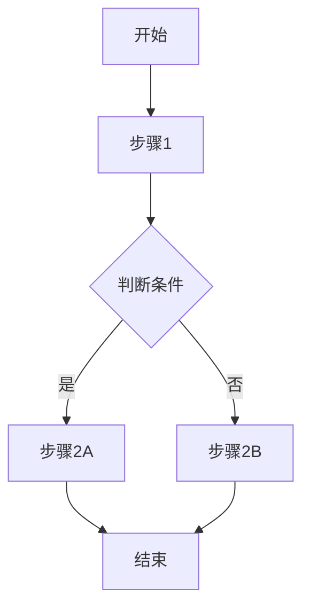

# PRD 模板

> 使用说明：复制此模板，将 `[...]` 中的内容替换为实际信息。保留结构但可根据需要增删章节。

---

# PRD: [功能/项目名称]

| 元数据 | 内容 |
|--------|------|
| 版本 | v[0.1] |
| 作者 | [姓名] |
| 状态 | [草稿 / 评审中 / 已定稿] |
| 最后更新 | [YYYY-MM-DD] |

---

## 1. 背景与目标

### 1.1 为什么要做？

**问题陈述：**
[描述当前存在的问题或用户痛点，300 字以内]

**背景：**
[项目的背景信息，如用户反馈、数据分析结果、竞品动态等]

### 1.2 业务目标

| 目标 | 衡量指标 | 当前值 | 目标值 | 时间节点 |
|------|---------|-------|-------|---------|
| [目标 1] | [指标] | [数值] | [数值] | [日期] |
| [目标 2] | [指标] | [数值] | [数值] | [日期] |

### 1.3 成功标准

> 如何判断这个功能上线后是成功的？

- [ ] [具体可量化的成功标准，如：结算转化率提升 5% 以上]
- [ ] [如：新功能日活用户超过 1000]
- [ ] [如：用户满意度评分 ≥ 4.5/5]

---

## 2. 范围

### 2.1 In Scope（包含的功能）

- [功能 1：简要描述]
- [功能 2：简要描述]
- [功能 3：简要描述]

### 2.2 Out of Scope（本次不包含）

- [功能/需求 1：说明为什么这次不做]
- [功能/需求 2：说明为什么这次不做]

### 2.3 依赖项

| 依赖项 | 类型 | 状态 | 负责人 |
|--------|------|------|-------|
| [如：用户登录模块] | [内部/外部] | [就绪/开发中] | [团队/人] |
| [如：第三方支付 API] | [内部/外部] | [就绪/开发中] | [团队/人] |

---

## 3. 用户画像与场景

### 3.1 目标用户

| 用户类型 | 特征 | 使用频率 | 技术熟悉度 |
|---------|------|---------|-----------|
| [如：新访客] | [描述] | [低频] | [低] |
| [如：注册用户] | [描述] | [中等] | [中] |

### 3.2 用户场景

**场景 1：[场景名称]**
```
用户：[用户类型]
目标：[用户想达成什么]
触发条件：[什么情况下触发这个场景]
```

**场景 2：[场景名称]**
```
用户：[用户类型]
目标：[用户想达成什么]
触发条件：[什么情况下触发这个场景]
```

### 3.3 用户流程图

```
[开始] → [步骤 1] → [分支判断] → [步骤 2A] / [步骤 2B] → [结束]
```

（可附流程图图片或使用 Mermaid 语法）



---

## 4. 功能详述

### 4.1 功能总览

| 优先级 | 功能 | 描述 | 预估工时 | 状态 |
|--------|------|------|---------|------|
| P0 | [功能名] | [一句话描述] | [人天] | [待评审] |
| P1 | [功能名] | [一句话描述] | [人天] | [待评审] |
| P2 | [功能名] | [一句话描述] | [人天] | [待评审] |

*优先级定义：P0=必须有 / P1=应该有 / P2=可以有*

### 4.2 功能详情

#### 功能 1：[功能名称]

**交互流程：**
1. [步骤 1：用户做了什么]
2. [步骤 2：系统如何响应]
3. [步骤 3：用户进一步操作]
4. [步骤 4：最终结果]

**界面说明：**
[描述界面布局和元素。附设计稿链接或截图]

**数据规则：**
| 字段 | 类型 | 规则 | 必填 |
|------|------|------|------|
| [字段名] | [string/number/...] | [验证规则] | 是/否 |
| [字段名] | [string/number/...] | [验证规则] | 是/否 |

**异常处理：**
| 异常场景 | 系统行为 |
|---------|---------|
| [如：网络超时] | [显示什么提示，用户如何恢复] |
| [如：数据校验失败] | [提示什么错误信息] |
| [如：权限不足] | [如何处理] |

---

## 5. 非功能需求

### 5.1 性能要求

- 页面加载时间不超过 [X] 秒
- 接口响应时间不超过 [X] 毫秒
- 支持 [X] 用户同时在线

### 5.2 安全要求

- [如：敏感数据加密存储]
- [如：接口需要鉴权]
- [如：XSS/CSRF 防护]

### 5.3 兼容性要求

- 支持浏览器：[如 Chrome/Firefox/Safari 最近 2 个主版本]
- 支持屏幕尺寸：[如 320px ~ 1920px]
- 支持设备：[桌面端 / 移动端 / 平板]

### 5.4 国际化/本地化

- [ ] 需要支持多语言
- [ ] 需要考虑从右到左(RTL)布局
- [ ] 货币/日期格式本地化

---

## 6. 数据与指标

### 6.1 埋点需求

| 事件 | 触发时机 | 附带参数 |
|------|---------|---------|
| [event_name] | [用户在什么场景下触发] | {key: value} |
| [event_name] | [用户在什么场景下触发] | {key: value} |

### 6.2 核心指标

| 指标名称 | 定义 | 计算公式 |
|---------|------|---------|
| [指标] | [定义] | [公式] |
| [指标] | [定义] | [公式] |

---

## 7. 发布计划

### 7.1 阶段划分

| 阶段 | 时间 | 交付内容 | 验收人 |
|------|------|---------|-------|
| 设计评审 | [日期] | 设计稿 | [姓名] |
| 技术评审 | [日期] | 技术方案 | [姓名] |
| 开发完成 | [日期] | 功能开发 | [姓名] |
| QA 测试 | [日期] | 测试报告 | [姓名] |
| 上线 | [日期] | 正式发布 | [姓名] |

### 7.2 发布检查清单

- [ ] 所有 P0 功能测试通过
- [ ] 无严重/致命 Bug
- [ ] 性能指标达标
- [ ] 埋点验证通过
- [ ] 上线前备份完成
- [ ] 回滚方案已准备

### 7.3 回滚方案

[描述如果上线后发现严重问题，如何回滚，预计回滚耗时多久]

---

## 8. 附录

- 设计稿：[Figma/其他链接]
- 原型：[链接]
- 技术方案文档：[链接]
- 相关 PRD：[链接]

---

**变更历史**

| 版本 | 日期 | 变更内容 | 变更人 |
|------|------|---------|-------|
| v0.1 | [YYYY-MM-DD] | 初稿 | [姓名] |
| v0.2 | [YYYY-MM-DD] | [变更新增内容] | [姓名] |
